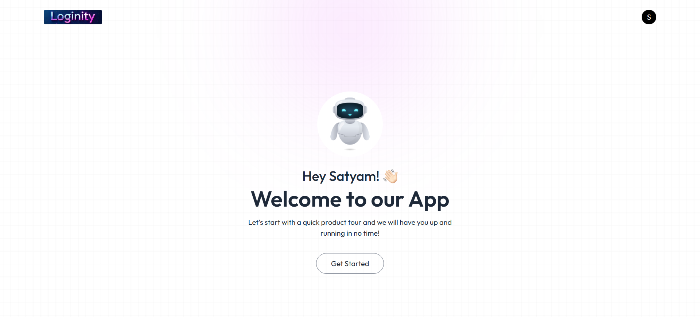
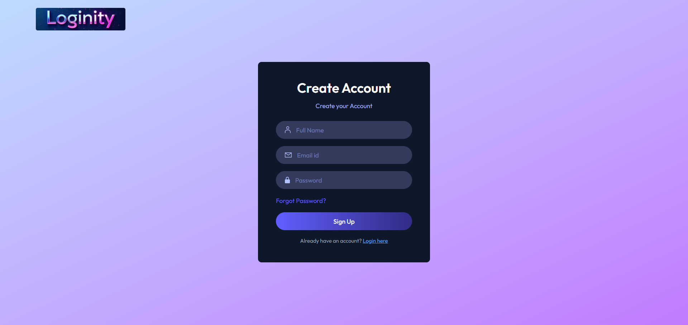
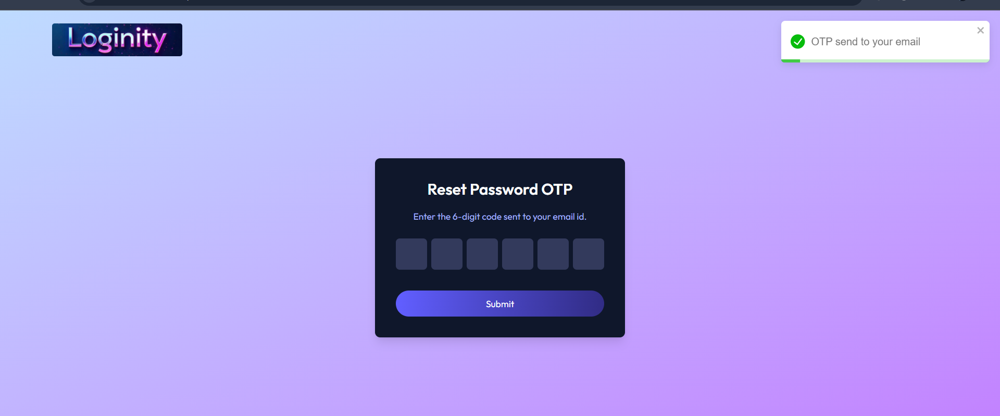
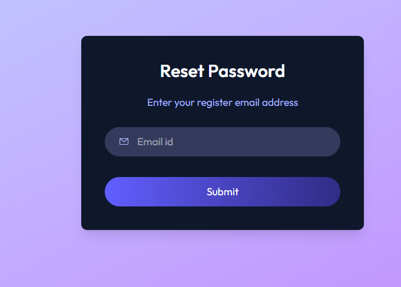
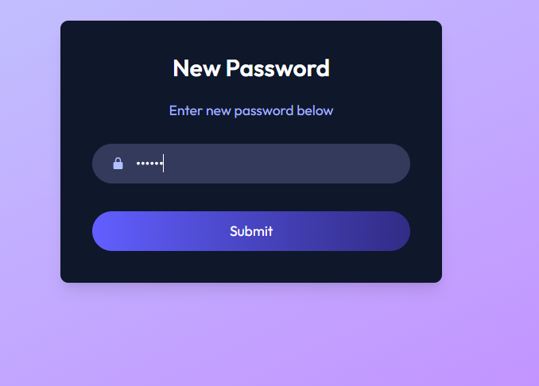

<div align="center">


# 🔐 Loginity – MERN Authentication App  

</div>

Loginity is a **full-stack authentication system** built with the **MERN stack**. It provides a secure and modern authentication flow with **email verification via OTP**, **JWT-based session management**, and **password reset functionality**.

✨ Designed with **TailwindCSS** for a clean UI and integrated with **React-Toastify** for smooth notifications.

---

## ⚡ Features

* ✅ User registration with email verification (OTP via Nodemailer)
* ✅ Secure login with **JWT stored in HttpOnly cookies**
* ✅ Reset password via verified email
* ✅ Protected routes with middleware authentication
* ✅ Modern UI with **Tailwind CSS**
* ✅ Toast notifications using **React-Toastify**

---

## 🛠️ Tech Stack

**Frontend (Client):**

* React.js
* Tailwind CSS
* React-Toastify

**Backend (Server):**

* Node.js
* Express.js
* MongoDB + Mongoose
* JWT (JSON Web Token)
* Nodemailer

---

## 📂 Project Structure

```
loginity/
│
├── client/           # React frontend
│   ├── src/
│   │   ├── components/
│   │   ├── pages/
│   │   ├── context/
│   |   ├── assets/
│   │   └── App.js
│   └── package.json
│
├── server/           # Node.js backend
│   ├── config/
│   ├── controllers/
│   ├── middleware/
│   ├── models/
│   ├── routes/
│   └── server.js
│
└── README.md
```

---

## ⚙️ Setup Instructions

### 1. Clone the Repository

```bash
git clone https://github.com/your-username/loginity.git
cd loginity
```

### 2. Setup Backend (Server)

```bash
cd server
npm install
```

#### Create `.env` file in `/server` with:

```env
PORT=4000
MONGO_URI=your_mongodb_uri
JWT_SECRET=your_jwt_secret
SMTP_HOST=smtp.yourmail.com
SMTP_PORT=587
SMTP_USER=your_email@example.com
SMTP_PASS=your_email_password
CLIENT_URL=http://localhost:5173
```

#### Run server:

```bash
npm run dev
```

---

### 3. Setup Frontend (Client)

```bash
cd ../client
npm install
```

#### Create `.env` file in `/client` with:

```env
VITE_API_URL=http://localhost:4000
```

#### Run client:

```bash
npm run dev
```

---

## 🚀 Usage Flow

1. Register with your email
2. Verify your email via OTP
3. Login securely (JWT saved in cookie)
4. Access protected routes
5. Reset password if needed

---

## 📸 Screenshots  

Take a quick look at the **Loginity authentication flow** 👇  

---

### 1️⃣ Home Page  
<div align="center">

</div>

---

### 2️⃣ Login Page  
<div align="center">

</div>

---

### 3️⃣ OTP Verification  
<div align="center">

</div>

---

### 4️⃣ Reset Password  
<div align="center">

</div>

---

### 5️⃣ New Password  
<div align="center">

</div>

